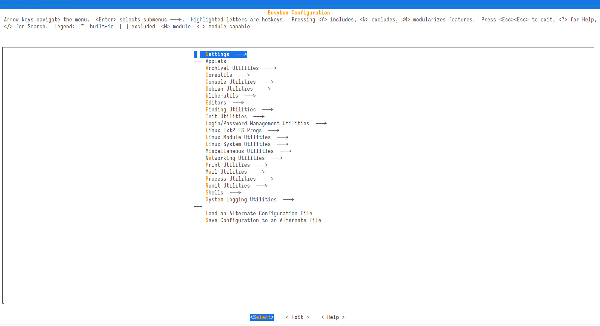
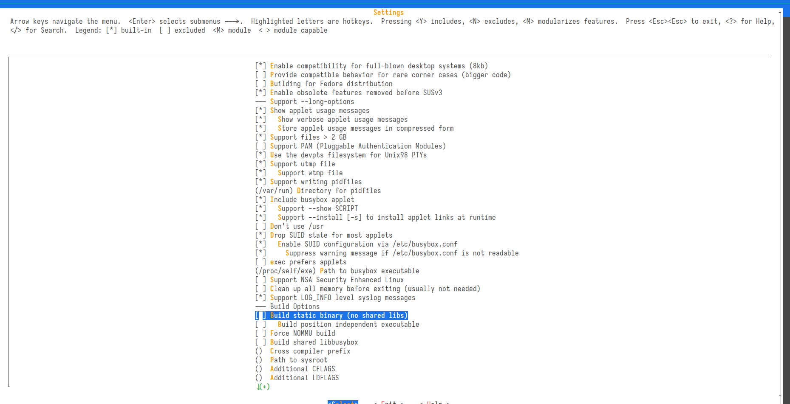

# busybox-loongarch

## 安装工具链muslc

1. 下载 LoongArch musl libc库

```sh
git clone https://github.com/LoongsonLab/oscomp-musl-1.2.4.git
cd ./oscomp-musl-1.2.4
```

2. 配置编译参数

```sh
./configure --target=loongarch64-linux-gnu CFLAGS="-mabi=lp64d" --prefix=/opt/loongarch-muslc
```

`--prefix=/opt/loongarch-muslc`：这个选项指定了安装路径。配置后的软件包将安装到 /opt/loongarch-muslc 目录下。

3. 编译安装

```sh
make -j 16
make install -j 16
```

## busybox 编译

1. 下载 Linux 并引入相关头文件

下载 [Linux源码](https://mirrors.edge.kernel.org/pub/linux/kernel/)

进入 Linux 源码的目录后执行以下指令

```sh
make ARCH=loongarch INSTALL_HDR_PATH=../temp headers_install
```

2. 更改busybox的Makefile

```sh
CFLAGS		:= $(CFLAGS) -I /**/include
LDFLAGS		:= $(LDFLAGS) -L/**/lib
```

3. 修改编译选项

```sh
make defconfig
CONFIG_TC=y ==> CONFIG_TC=n

nvim scripts/kconfig/lxdialog/check-lxdialog.sh
main ==> int main()
```

```sh
make menuconfig 设置静态编译
```

键入命令后进入 menuconfig 界面，按照图中的选项选择后推出并保存





4. 编译生成可执行程序

```sh
make  CROSS_COMPILE=musl- -j 16
make  CROSS_COMPILE=musl- install -j 16
```
